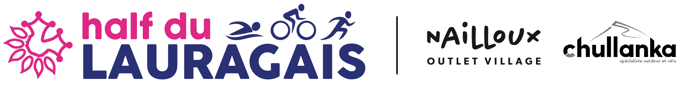

# SAE S5 grp2 TOAC



## The Team

### Initials students
- [Luca Straputicari](https://github.com/lucastrap)
- [Thomas Deyemere](https://github.com/bsct-tormod)
- [Matéo Pepin](https://github.com/SOLUPRED3)
- [Hai Son Dang](https://github.com/haisondang)

### Apprenticeship students
- [Olivier Recher](https://github.com/OlivierRecher)
- [Thomas Masin](https://github.com/caerroff)
- [Hugo Monté](https://github.com/hugomonte)
- [Mohammed Kerrouche](https://github.com/Fiujy)

## Project Context

This GitHub repository has been created for the [SAE5.A.01](https://webetud.iut-blagnac.fr/course/view.php?id=1131) project.

### If you wish to access our current version: [TOAC Website](https://lucastrap.github.io/S5-SAE-TOAC-grp2/)

### Description

Our mission is to improve the TOAC Triathlon club website by implementing additional features to enhance user experience. Here is the existing website (link: [TOAC Triathlon](https://half.toac-triathlon.com/)), which is already online but requires improvements and new features to meet the client's needs. Our contact person for this project is [Laurène Ronfort](https://fr.linkedin.com/in/laurene-ronfort).

### Objectives

- Have a primarily scroll-based website with a parallax effect.
- Provide solutions to the client to improve website SEO.
- Simplify the website's structure.
- Train the TOAC Triathlon team in website maintenance.
- Integrate the Instagram feed from the [TOAC page](https://www.instagram.com/toactriathlon/).

### Current Project Progress:

[████████████████████████████████░░░░░░░░░░░░░░░░░░░░░░] 65%

### Here is a slideshow presenting the client and their needs: [TOAC Slideshow](https://docs.google.com/presentation/d/19AGVjNUYI3qM5f7slZo5BkiuPfHRaJR4KTdoPo22Uow/edit#slide=id.g27b0f7cac84_1_155)

## Repository Structure

We work using the agile method, in one-week sprints.

```
├── Project TOAC
│ ├── Images_Site
│ ├── code
│ ├── docker
│ ├── documents
│ └── symfony
│
└── README.md
```

Project Phase 1: [Phase 1](https://github.com/lucastrap/S5-SAE-TOAC-grp2/issues?q=is%3Aopen+is%3Aissue+milestone%3A%22Phase+1%22)

Project Phase 2: [Phase 2](https://github.com/lucastrap/S5-SAE-TOAC-grp2/issues?q=is%3Aopen+is%3Aissue+milestone%3A%22Phase+2%22)

Project Phase 3: To be defined

## Useful Links

- Current version of [TOAC Website](https://half.toac-triathlon.com/)
- Our current version of [TOAC Website](https://lucastrap.github.io/S5-SAE-TOAC-grp2/)

## Documents
- [Technical Document](./documents/documentation_technique.adoc)
- [Existing Analysis](./documents/AnalyseExistant.pdf)
- [Final Report]
- [Mohamed Kerrouche Report](./documents/rapportsAlternants/KerroucheMohamedToec.pdf)
