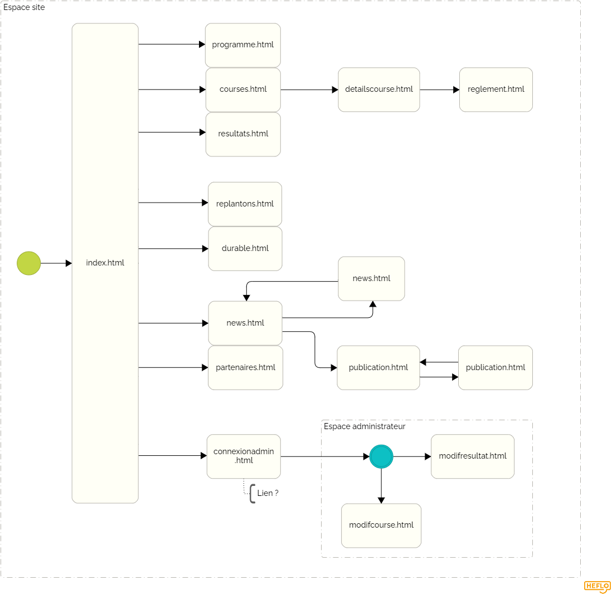

= Documentation technique du site web du Half du Lauragais
:toc:
:toc-title: Sommaire

Groupe *4* : Luca STRAPUTICARI, Thomas DEMEYERE, Matéo PEPIN, Hai Son DANG

{empty} +

== I. Présentation du site web
[.text-justify]
Le site web sert à la présentation de l'évènement triathlon du TOAC nommé "half du lauragais". Il donne toutes les informations et l'accès à toutes les ressources à propos de ce dernier.

=== 1. Les utilisateurs :
[.text-justify]
Le site web peut être utilisé par n'importe quel utilisateur . Cependant il existe un type d'utilisateur pouvant être connecté pour accéder à certaines fonctionnalités : les administrateurs.

Use-Cases :

image::documentation/images/nomImage.png[Use Case, 400]

{empty} +

[.text-justify]
Les *utilisateurs* de base peuvent :

* S'informer sur les courses
* S'inscrire à une course
* S'informer sur les résultats
* Consulter le fil instagram
* S'informer sur l'écoresponsabilité de l'organisation
* Consulter les news de l'organisation

{empty} +

[.text-justify]
Les *administrateurs* ont accès à un pannel servant à la gestion du site, avec ce dernier ils peuvent :

* Consulter et modifier les résultats
* Ajouter une course dans la liste
* Ajouter/Supprimer des publications dans le fil d'actualité
* Accéder au panneau google analytics

{empty} +

== II. Architecture
=== 1. Structure du site :
[.text-justify]
Tous les fichiers fonctionnels du site se trouvent dans le répertoire `code/` du dépôt GitHub.

Diagramme SEP :

{empty} +

Aperçu de l'arborescence :

[source]
----
├───Images_Site
├───code
└───documentation
    └───images
----
